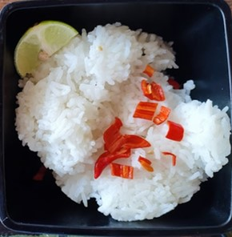
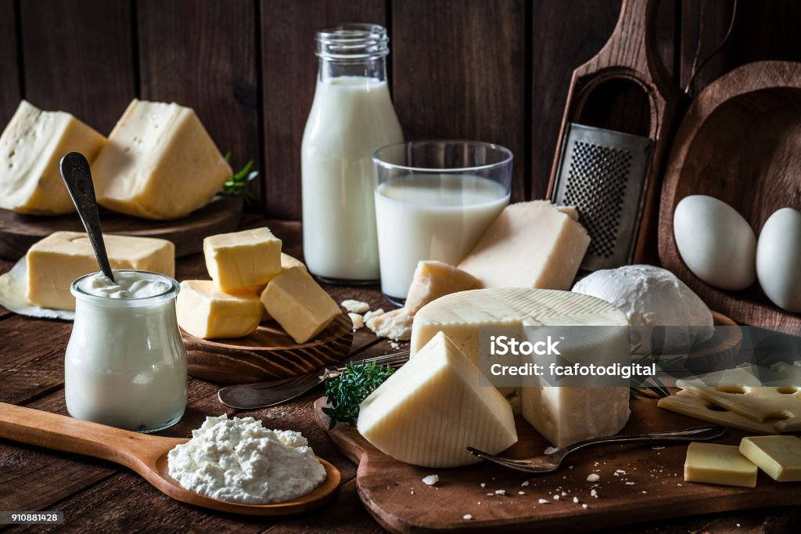
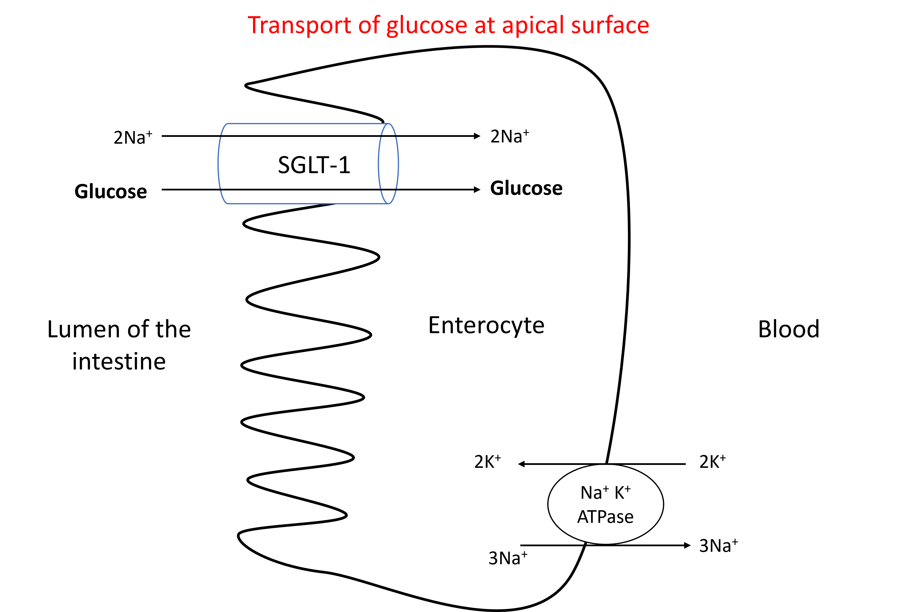

# Digestion, absorption, uptake of glucose into tissues {#Digestion}

## Carbohydrates in our food
The common carbohydrates present in our food are starch, lactose, sucrose, fructose, cellulose and other dietary fibres.

### Starch {-}

Starch is the most common carbohydrate present in our diet. Starch is abundant in cereals (rice, wheat), tubers (potato) and other vegetables.

{width=50%, height=250}

### Lactose {-}

Lactose is present in milk and milk containing products.

{width=50%}

### Fructose {-}

Fructose is present in honey and fruits.

{width=50%}

### Sucrose {-}

Sucrose is present in sugar and fruits.

{width=50%}

### Cellulose {-}

Cellulose and other dietary fibres are present in green leafy vegetables, whole grains, and fruits.

{width=50%}

[Explore carbohydrate content in Indian food](padmanaban55.github.io/CarbohydrateContent)

## Digestion of carbohydrates

The purpose of digestion is to breakdown large polymers into their monomers so that they can transported across the plasma membrane of the intestinal cells into the body. Digestion of carbohydrates converts polysaccharides and disaccharides into *monosaccharides* which can be transported across the intestinal cell (enterocytes). Digestion of carbohydrates is achieved by the enzymes; Salivary and pancreatic amylases, and intestinal disaccharidases. 

### Digestion of starch by amylase

Digestion of carbohydrates begins in the mouth. Salivary glands secrete the enzyme salivary amylase, and salivary amylase breaks down the polysaccharide starch into smaller pieces. When the food enters the stomach, the acidic pH of the stomach inactivates amylase and so carbohydrate digestion does not happen in stomach. When the food leaves stomach and enters duodenum, it will be acted upon by pancreatic amylase secreted by pancreas.Pancreatic amylase digests the remaining starch (and glycogen) into dextrins, oligosaccharides and disaccharides.

Amylase breaks 1 to 4 glycosidic bonds of the starch at random places resulting in smaller version of amylopectin called dextrin, and release of the disaccharide Maltose, isomaltose, and the trisaccharide maltotriose. 

### Digestion of disaccharides by disaccharidases
The epithelial cells (enterocytes) of the small intestine produce a group of enzymes called disaccharidases along their brush border.

These disaccharidases are:
+Lactase
+Sucrase
+Iso-maltase
+Maltase
+Trehalase 

Maltase digests maltose into two units of glucose. The sucrase-isomaltase enzyme complex digests sucrose and isomaltose into glucose and fructose, and two glucose units respectively. The enzyme lactase digests lactose into glucose and galactose.

## Absorption of monosaccharides

Glucose and galactose are absorbed by enterocytes at the apical surface through sodium-dependent glucose transporter -1 (SGLT-1) (Secondary active transport). 

Sodium potassium ATPase located at the basolateral surface of the eneterocytes create a concentration gradient of sodium across the apical surface by pumping sodium out at the basolateral side. Sodium is transported through SGLT-1 along the concentration gradient (higher concentration of sodium in the lumen of intestine to lower concentration of sodium inside the eneterocytes). However, SGLT-1 couples the transport of sodium with transport of glucose across the apical surface against it's concentration gradient. This process is illustrated below.

{width=60%, height=400}
[^1]

Fructose enters enterocytes through GLUT-5 (Facilitated diffusion) at the apical surface.

Glucose, galactose, and fructose are transported into the blood from enterocytes (basal surface) through GLUT-2 (Facilitated diffusion).

## Glucose transporters

Glucose is transported across plasma membrane of cells by  transport proteins. Broadly there two families of glucose transporters: Sodium-dependent glucose transporter family (SGLT) and Glucose transporter family (GLUT). SGLT transporters act via secondary active transport and is present in intestine and kidney.

GLUT family of transporters are involved in facilitated diffusion of glucose and other hexoses. There are 14 different types of GLUT proteins. Different types of GLUT are present in different types of tissues which differ in the kinetics of transport and their regulation. These differences reflect the physiological role of the tissues in carbohydrate metabolism. The table below illustrates this concept with important examples.

| Transporter| Tissue distribution   | Function  |
|-------|:----------:|-----------:|
| GLUT-1     | RBCs, blood-brain barrier  | Glucose uptake at basal conditions|
| GLUT-2     | Small intestine,Pancreatic beta cells,Liver and kidney|Absorption of glucose, Allows free entry of glucose into the beta cells and liver|
| GLUT-3    | Neurons                    |High-affinity uptake of glucose by brain and nervous tissue even at lower concentrations|
| GLUT-4    | Adipose tissue, skeletal muscle and heart|Insulin stimulated uptake of glucose|

[Explore the GLUT transporter app](padmanaban55.github.io/GLUT_Transporters/)

## Clinical applications

### ORS

Oral rehydration solution is a combination of glucose and sodium used to treat dehydration (loss of water from body). Presence of glucose aids in the absorption of sodium via SGLT-1. Absorption of sodium is accompanied by absorption of water to maintain osmotic equilibrium. This results in more efficient absorption of water. 

{width=60%, height=400}
[^1]

### Lactose intolerane

Lactose intolerane occurs due to deficiency of lactase enzyme. The most common reason is lactase non-persistence genotype seen among many populations around the world. The enzyme lactase responsible for digestion of lactose is present during childhood but it's expression declines with age in these populations. Some populations express lactase enzyme well into adulthood due to a genetic mutation and are capable of digesting lactose. Less commonly transient decrease in lactase enzyme due to intestinal diseases can lead to transient lactose intolerance. Rarely, congenital deficiency of lactase enzyme can lead to lactose intolerance in infants.

Clinical features of lactose intolerance includes bloating, abdominal pain, and diarrhea after consuming milk and milk containing products. Undigested lactose is osmotically active which causes increased secretion of water from intestine leading to diarrhea. Undigested lactose is also fermented by the large intestinal bacteria releasing gases in the intestine causing distension and bloating of abdomen. Treatment involves avoiding milk and milk containing food, and if required lactase enzyme supplementation.

### Dietary fibre

Certain carbohydrate and non-carbohydrates present in plant food that are indigestible are called dietar fibres. Examples: Cellulose, hemicellulose, pectin and lignin. Dietary sources include cereals, whole grains, vegetables, fruits, legumes, bran, and nuts. Some fibres delay gastric emptying and causes increased satiety thus reducing the amount of food intake. Other fibres absorb water and increase the bulk of stool and eases defecation thus preventing constipation. Increased satiety helps in weight reduction. Reduced rate of absorption of glucose due to fibres is beneficial for people with diabetes mellitus.Other benefits include reduction in cholesterol level and reduced risk of colon cancer. 

## Practice exercises

1. Match the carbohydrates with their corresponding digestive enzyme

- "Sucrose: <select class='webex-select'><option value='blank'></option><option value=''>Maltase</option><option value=''>Amylase</option><option value=''>Lactase</option><option value='answer'>Sucrase</option></select>"

- "Starch: <select class='webex-select'><option value='blank'></option><option value=''>Maltase</option><option value='answer'>Amylase</option><option value=''>Lactase</option><option value=''>Sucrase</option></select>"

- "Maltose: <select class='webex-select'><option value='blank'></option><option value='answer'>Maltase</option><option value=''>Amylase</option><option value=''>Lactase</option><option value=''>Sucrase</option></select>"

- "Lactose: <select class='webex-select'><option value='blank'></option><option value=''>Maltase</option><option value=''>Amylase</option><option value='answer'>Lactase</option><option value=''>Sucrase</option></select>"

2. Green leafy vegetables are a good source of dietary fibres: <select class='webex-select'><option value='blank'></option><option value='answer'>TRUE</option><option value=''>FALSE</option></select>

3. Consumption of which of the following carbohydrate helps in preventing constipation??

<label><input type="radio" autocomplete="off" name="radio_LULRKNHYAF" value=""></input> Starch</label><label><input type="radio" autocomplete="off" name="radio_LULRKNHYAF" value="answer"></input> Cellulose</label><label><input type="radio" autocomplete="off" name="radio_LULRKNHYAF" value=""></input> Heparin</label><label><input type="radio" autocomplete="off" name="radio_LULRKNHYAF" value=""></input> Glycogen</label>

4. Absorption of glucose at the apical (luminal) side of the enterocyte is through

<label><input type="radio" autocomplete="off" name="radio_CIKLKKJZBG" value=""></input> Primary active transport</label><label><input type="radio" autocomplete="off" name="radio_CIKLKKJZBG" value=""></input> Passive diffusion</label><label><input type="radio" autocomplete="off" name="radio_CIKLKKJZBG" value="answer"></input> Secondary active transport</label><label><input type="radio" autocomplete="off" name="radio_CIKLKKJZBG" value=""></input> Faciliated diffusion</label>

[^1]:Made by Dr.Monica Peter

