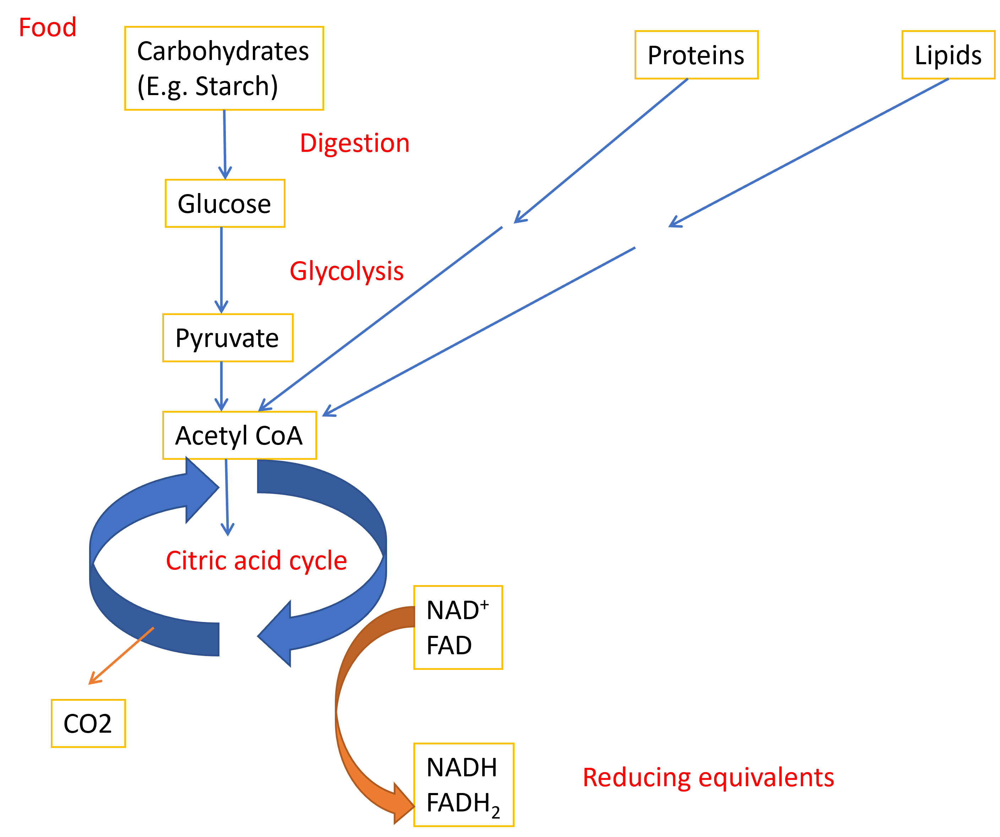
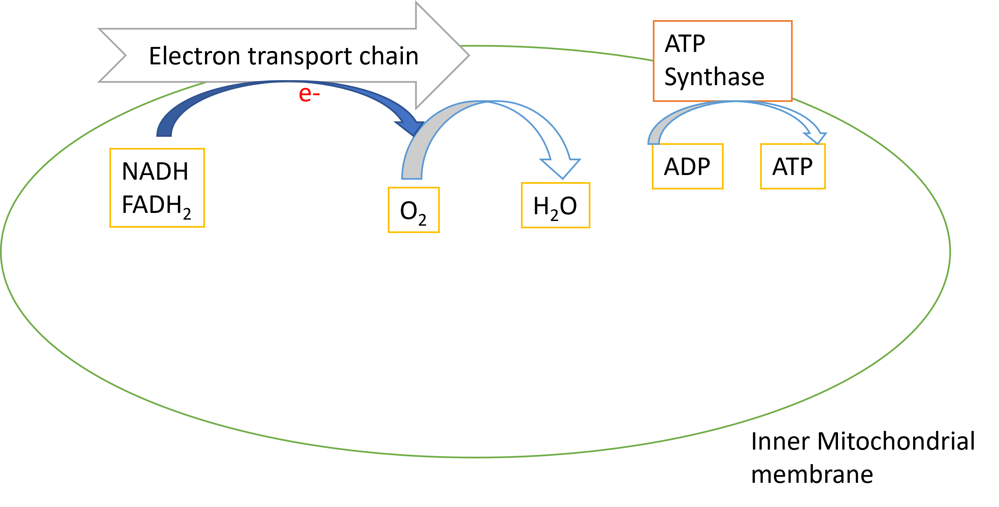
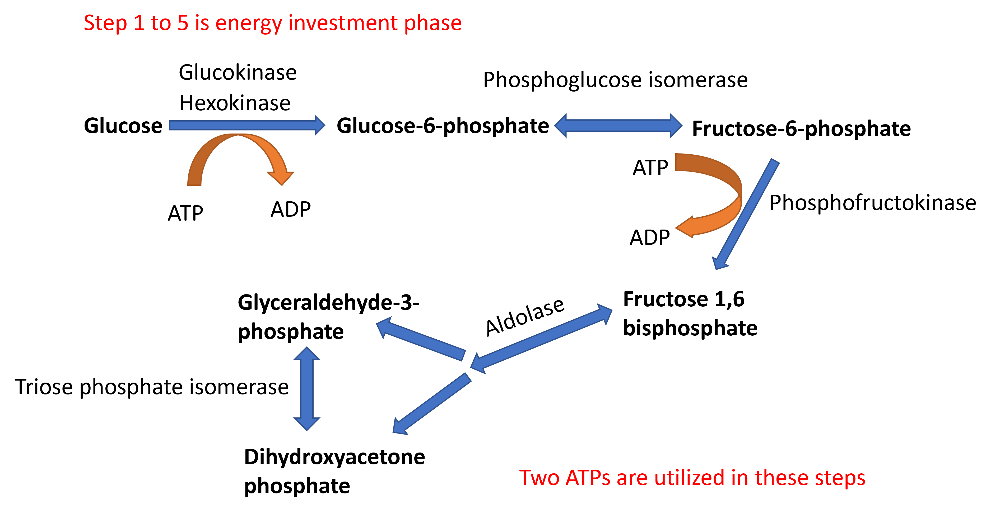
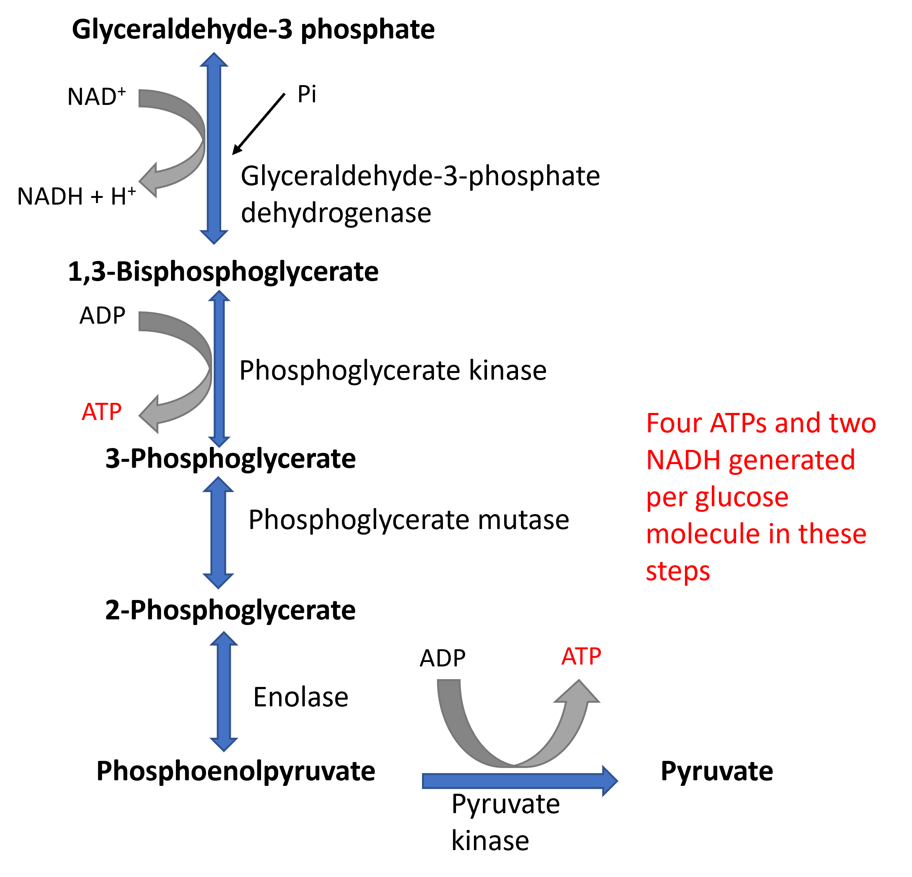
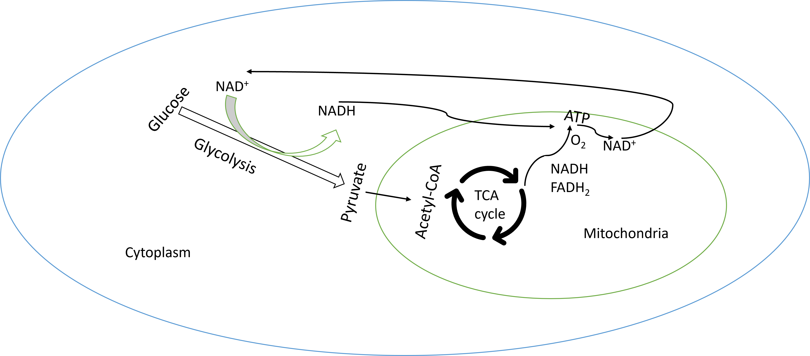
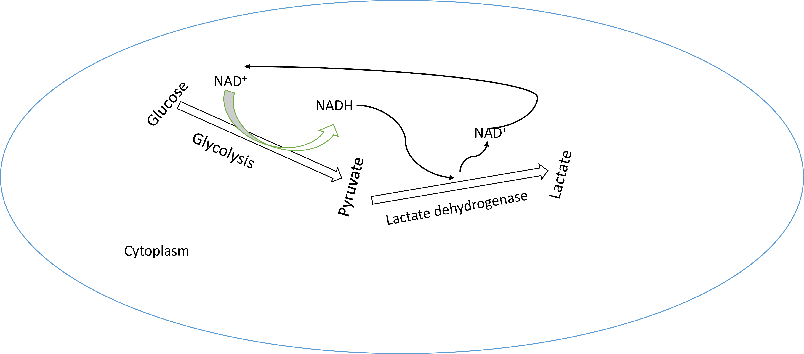

# Glycolysis

## Metabolism

Metabolism is defined as the set of all biochemical reactions that sustains life. Metabolic reactions can be classified as catabolism or anabolism. Catabolism is defined as set of reactions that are involved in utilizing chemical energy of nutrients to produce ATP. Anabolism involves reactions that are involved in synthesis of new biomolecules from precursors. 

Catabolism involves breakdown of complex molecules into its component building blocks, conversion of building blocks into acetyl CoA and oxidation of acetyl CoA to produce ATP. 

{width=80%, height=400}

{width=80%, height=200}

## Overview of carbohydrate metabolism

{width=80%, height=400}

### Glycolysis

Glycolysis is the major pathway for oxidation of glucose.Glycolysis is the pathway in which glucose is broken down to pyruvate to produce ATP in all tissues.In the presence of oxygen, pyruvate is converted to acetyl-CoA which is further oxidized in citric acid cycle to produce ATP In the absence of oxygen, pyruvate is converted to lactate

### Reactions of glycolysis

First 5 steps of glycolysis involves activation of glucose by phosphorylation in two steps and lysis to release two molecules of Glyceraldehyde-3-phosphate which is a 3 carbon molecule. This phase requires investment of 2 ATPs.

{width=70%, height=400}

In the next phase, glyceraldehyde-3 phosphate is oxidized with reduction of NAD^+ to NADH and substrate level phosphorylation at two steps to produce 4 ATPs per glyceraldehyde-3 phosphate.

{width=50%, height=400}

### Aerobic glycolysis

Pyruvate is the end product of aerobic glycolysis. Pyruvate is further oxidized to acetyl-CoA and acetyl-CoA is oxidised in TCA cycle to reduce NAD^+^ and FAD to NADH and FADH~2~. NADH produced in glycolysis and TCA cycle is converted back to NAD^+^ in the process of oxidative phosphorylation (which produces ATP in presence of oxygen). Regeneration of NAD^+^ is necessary to sustain glycolysis.

{width=80%, height=200}

### Anaerobic glycolysis

In the absence of oxygen as in the case of muscle during sternous exercise or hypoxia due to reduced blood supply to tissues or in cells that lack mitochondria such as RBCs, the oxidation of NADH through oxidative phosphorylation does not take place. However, to produce ATP even in the absence of oxygen or mitochondria, NADH is oxidized to NAD^+ with the help of reduction of pyruvate to lactate. 

{width=80%, height=200}

### Energetics of glycolysis

Aerobic glycolysis produces 2 net ATPs and 2 NADH during the conversion of glucose to pyruvate. However, the complete oxidation of glucose to 6 carbon dioxide through further oxidation of pyruvate and TCA cycle produces a total of 32 molecules of ATP per glucose molecule.

Anaerobic glycolysis on the other hand will produce only 2 ATP per glucose molecule.

### Regulation of glycolysis

Phosphofructokinase (PFK-1) is the rate limiting enzyme of glycolysis. PFK-1 is inhibited allosterically when there is an increase in energy levels (indicated by ATP and citrate levels) and activated allosterically when there is decrease in energy levels (AMP).

PFK-1 is also regulated bby  fructose 2,6 bisphosphate (Fr 2,6 BP), an allosteric activator. [Levels of Fructose 2,6 bisphosphate are regulated by Insulin and Glucagon](#regulation-of-glycolysis-and-gluconeogenesis).

### 2,3 Bisphosphoglycerate pathway/Rapaport- Luebering shunt

This pathway is active only in RBCs and it involves production of 2,3 Bisphosphoglycerate from 1,3 Bisphosphoglycerate. 2,3 BPG binds to haemoglobin in RBCs and decreases its affinity to oxygen. 2,3 BPG favours release of oxygen from haemoglobin to tissues. Hypoxic conditions increases the production of 2,3 BPG helping the RBCs to deliver oxygen efficiently. 

### Glycolysis inhibitor for blood collection

Sodium fluoride is an inhibitor of the enzyme enolase and this is added to blood samples collected for glucose estimation to stop consumption of glucose via glycolysis. 

## Practice exercises

1. Glycolysis is regulated by allosteric modification of the enzyme

<label><input type="radio" autocomplete="off" name="radio_QWJYPIMRCD" value=""></input> Enolase</label><label><input type="radio" autocomplete="off" name="radio_QWJYPIMRCD" value=""></input> Aldolase</label><label><input type="radio" autocomplete="off" name="radio_QWJYPIMRCD" value="answer"></input> Phosphofructokinase</label><label><input type="radio" autocomplete="off" name="radio_QWJYPIMRCD" value=""></input> Lactate dehydrogenase</label>

2. The main function of glycolysis is to produce energy: <select class='webex-select'><option value='blank'></option><option value='answer'>TRUE</option><option value=''>FALSE</option></select>

3. In Anerobic glycolysis, NADH is reoxidized to NAD by

<label><input type="radio" autocomplete="off" name="radio_ZCJDJYEBYP" value=""></input> TCA cycle</label><label><input type="radio" autocomplete="off" name="radio_ZCJDJYEBYP" value=""></input> Oxidative phosphorylation</label><label><input type="radio" autocomplete="off" name="radio_ZCJDJYEBYP" value=""></input> Phosphofructokinase</label><label><input type="radio" autocomplete="off" name="radio_ZCJDJYEBYP" value="answer"></input> Lactate dehydrogenase</label>

4. RBCs depends on which of the following pathway for it's energy needs?

<label><input type="radio" autocomplete="off" name="radio_THBGVKRFXN" value=""></input> TCA cycle</label><label><input type="radio" autocomplete="off" name="radio_THBGVKRFXN" value=""></input> Oxidative phosphorylation</label><label><input type="radio" autocomplete="off" name="radio_THBGVKRFXN" value="answer"></input> Glycolysis</label><label><input type="radio" autocomplete="off" name="radio_THBGVKRFXN" value=""></input> Oxidation of fatty acids</label>

