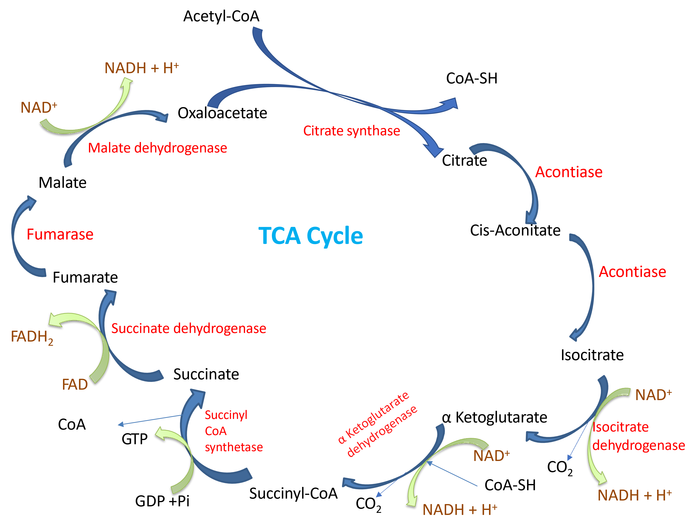

# TCA cycle

## Oxidation of pyruvate to acetyl-CoA

Pyruvate is oxidized to acetyl-CoA by the enzyme pyruvate dehydrogenase. Pyruvate dehydrogenase is a multienzyme complex with copies of three enzymes –E1, E2, and E3. Pyruvate dehydrogenase requires the co-enzymes thiamine, lipoic acid, CoA, FAD, and NAD for its function. The overall reaction is oxidative decarboxylation of pyruvate to acetyl-CoA with release of carbon dioxide and reduction of NAD^+^ to NADH. The whole process happens in mitochondria after pyruvate is transported into mitochondria.

## Citric acid cycle

Citric acid cycle is the  final metabolic pathway that produces energy from carbohydrates, proteins, and lipids. Citric acid cycle occurs  only in aerobic  conditions. Other names for the cycle are Kreb’s cycle, and the tricarboxylic acid (TCA) cycle. It is a series of 8 chemical reactions in mitochondria that generates energy by complete oxidation of acetyl-CoA to two carbon dioxide molecules while reducing 3 NAD^+^ and 1 FADH~2~. The reaction starts with consumption of oxaloacetate and ends with regeneration of oxaloacetate. Thus oxaloacetate is technically a catalyst for the TCA cycyle and is required only in small concentration. 

{width=50%, height=500}

Each turn of the cycle reduces 3 NAD^+^ to 3 NADH and 1 FADH to 1 FADH~2~ molecules along with substrate level phosphorylation to produce a GTP. Each NADH is capable of producing 2.5 ATPs, and each FADH~2~ is capable of producing 1.5 ATPs. Thus each turn of the cycle produces 10 ATPs (2.5 * 3 NADH + 1.5 * 1 FADH~2~ + 1 ATP (= 1 GTP)).

## Amphibolic pathway

Citric acid cycle is an amphibolic pathway i.e., it has  both anabolic and catabolic functions. It is catabolic since it is the final oxidation pathway for  carbohydrates, proteins, and lipids which prodduces ATP. It is anabolic because intermediate molecules in the citric acid cycle are used as sources of carbons for synthesis of glucose, amino acids, fatty acids, heme, and nucleotides. Anabolic reactions that consume TCA cycle intermediates are also called cataplerotic reactions. Reactions that replenish TCA cycle intermediates to sustain TCA cycle are called anaplerotic reactions. Glucogenic amino acids replenish TCA cyle intermediates in anaplerotic reactions. 

## Regulation of TCA cycle

TCA cycle is regulated at the level of formation of acetyl-CoA from pyruvate. Energy status of the cell and availability of reducing equivalents determine the rate of oxidation of pyruvate to acetyl-CoA.

The enzymes citrate synthase (release of CoA from Acetyl-CoA), isocitrate dehydrogenase (oxidation and release of CO~2~), and alpha-ketoglutarate dehydrogenase (oxidation and release of CO~2~) catalyze reactions that release large free energy and is regulated by energy level (ATP to AMP ratio) and reducing equivalents (NADH to NAD^+^ ratio) and are also regulated allosterically by their products.

## Practice exercises

1. The reactions that replenish intermediates of TCA cycle are called

<label><input type="radio" autocomplete="off" name="radio_OERRZUCUQQ" value=""></input> Anabolic reactions</label><label><input type="radio" autocomplete="off" name="radio_OERRZUCUQQ" value=""></input> Amphibolic reactions</label><label><input type="radio" autocomplete="off" name="radio_OERRZUCUQQ" value=""></input> Catabolic reactions</label><label><input type="radio" autocomplete="off" name="radio_OERRZUCUQQ" value="answer"></input> Anaplerotic reactions</label>

