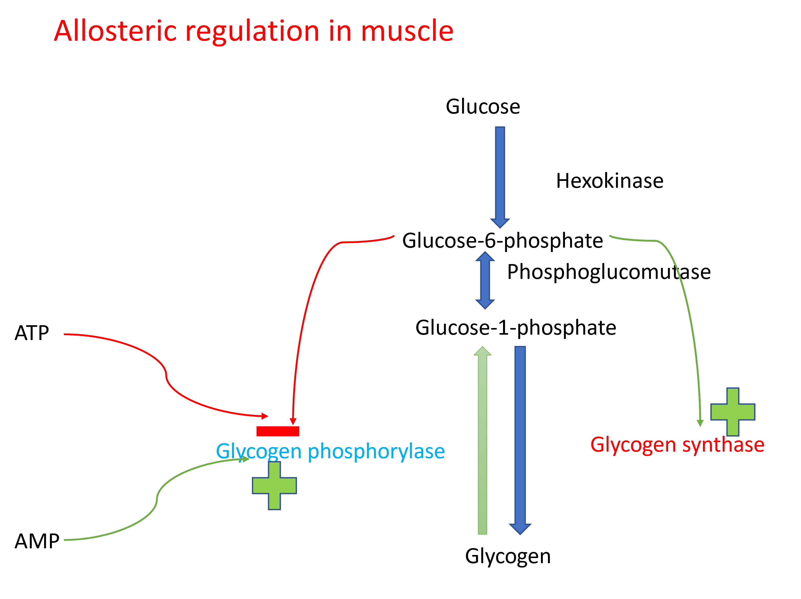

# Glycogen metabolism

## Importance of glycogen metabolism

During fasting, blood glucose is maintained by release of glucose from liver. Liver releases glucose by breaking down the stored glycogen into glucose units.Liver glycogen acts as the major source of blood glucose during fasting. In muscle, glycogen supplies glucose during exercise.  Muscle doesn’t release glucose into blood. During fed state (after eating food), glycogen stores must  be replenished by synthesising glycogen from glucose.

## Glycogenesis

Glycogenesis is the synthesis of glycogen from glucose during fed state in liver, and during resting state in muscle. The pathway take place in cytoplasm. 

Glucose should be activated by conjugation to UDP to take part in glycogenesis. UDP-Glucose is produced by reaction of UTP with glucose-1 phosphate. Glucose-1 phosphate is produced by phosphorylation of glucose to glucose-6 phosphate and then isomerism to glucose-1 phosphate.

Glycogen synthase catalyzes the formation of α (1 to 4) glycosidic bonds between glucose molecules to form glycogen, however it cannot use a free glucose molecule as an acceptor and can only catalyse α (1 to 4) glycosidic bond formation on a pre-existing chain of glucose molecules (primer). In absence of a primer, a protein called glycogenin adds at least 4 molecules of glucose to itself forming a primer. Glycogen synthase subsequently elongates the primer by adding glucose molecules and forming α (1 to 4) glycosidic bond them.

After sufficient elongation of the chain, a branching enzyme with 4 to 6 transferas activity cleaves a short segment of the chain by breaking a α (1 to 4) glycosidic bond and forming a α (1 to 6) glycosidic bond at a deeper point on the chain forming a branch. Elongation and branching repeats itself till the formation of the highly branched structure of glycogen.

{width=80%}

## Glycogenolysis

Glycogenolysis is the process of breakdown of glycogen into glucose. It occurs during fasting in liver and exercise in muscle. The enzyme glycogen phosphorylase sequentially removes glucose from glycogen as glucose-1 phosphate with the help of inorganic phosphate from the ends of the glycogen molecule resulting in formation of dextrin. The debranching enzyme with α (1 to 4) to α (1 to 4) glucantransferase activity, removes chain of glucose molecules from the branches and reattaches them to the end of linear chains. The glucose molecule at the branching point with α (1 to 6) glycosidic bond is removed by α (1 to 6) glucosidase activity of the debranching enzyme. Repeated action by glycogen phosphorylase and debranching enzyme results in release of glucose-1 phosphate. Glucose-1 phosphate is converted to glucose-6 phosphate. In the liver, glucose-6 phosphate is converted to glucose by glucose-6 phosphatase and release into the blood. Muscle lacks this enzyme and thus glucose-6 phosphate is used for glycolysis and ATP production in the muscle during exercise. 

{width=80%}

## Regulation of glycogen metabolism

Glycogenesis and glycogenolysis are tightly regulated.During well fed state, glycogen synthesis is increased in liver. During fasting, glycogenolysis is increased in liver.In muscle, glycogenolysis occurs during exercise and glycogenesis during rest.

Regulation occurs through allosteric regulators and covalent modification through hormonal regulation. 

### Allsoteric regulation of glycogen metabolism

{width=70%}

{width=70%}

### Hormonal regulation of glycogen metabolism

Major hormones involved in regulation of glycogen metabolism are Insulin, glucagon, and epinephrine. Insulin increases glycogenesis and decreases glycogenolysis. This happens during well fed state.
During fasting, glucagon increases glycogenolysis and decreases glycogenesis in liver. Epinephrine increases glycogenolysis and decreases glycogenesis in liver and muscle.

{width=80%}

{width=80%}

### Glycogen storage diseases

Glycogen storage diseases are a group of disorders with genetic defect in enzymes involved in synthesis or breakdown of glycogen. They are characterized by deposition of abnormal type or quantity  of glycogen in tissues. Some of the glycogen storage diseases are Von Gierke’s  disease, Pompe’s disease, Cori’s disease, and McArdle’s  syndrome.

The clinical features of Glycogen storage diseases include hepatomegaly (enlargement of liver), hypoglycemia especially during fasting (glycogenolysis is impaired), enlargement of kidneys (renomegaly), chronic kidney disease, muscle – weakness, and enlargement of heart (cardiomegaly).

| Type | Name of the disease | Enzyme involved |
| ---- | ------- | ------ |
| Type 1 | Von Gierke disease | Glucose 6-phosphatase |
| Type 2 | Pompe disease | Lysosomal  α (1 to 4) and α (1 to 6) glucosidase(acid maltase) |
| Type 3 | Limit dextrinosisForbe or Cori disease | Muscle debranching enzyme |
| Type 4 | Anderson disease | Branching enzyme |
| Type 5 | McArdle disease | Muscle phosphorylase |
| Type 6 | Hers disease | Liver phosphorylase |

