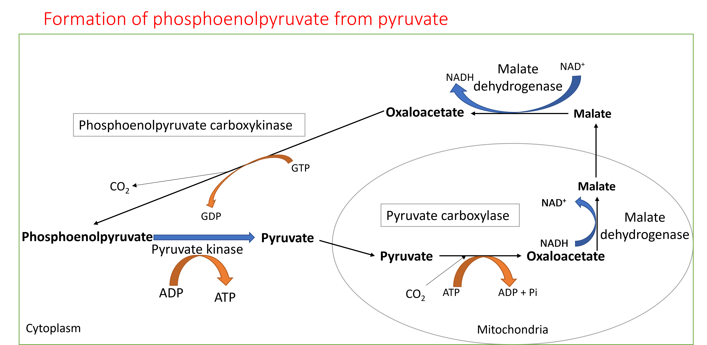
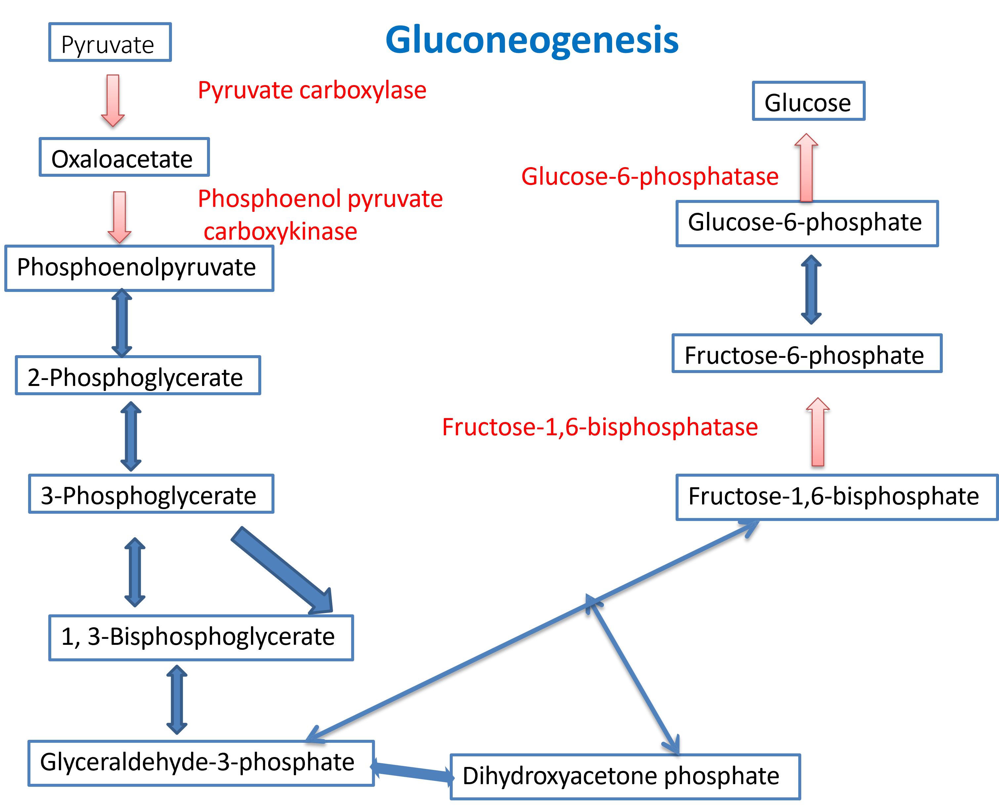
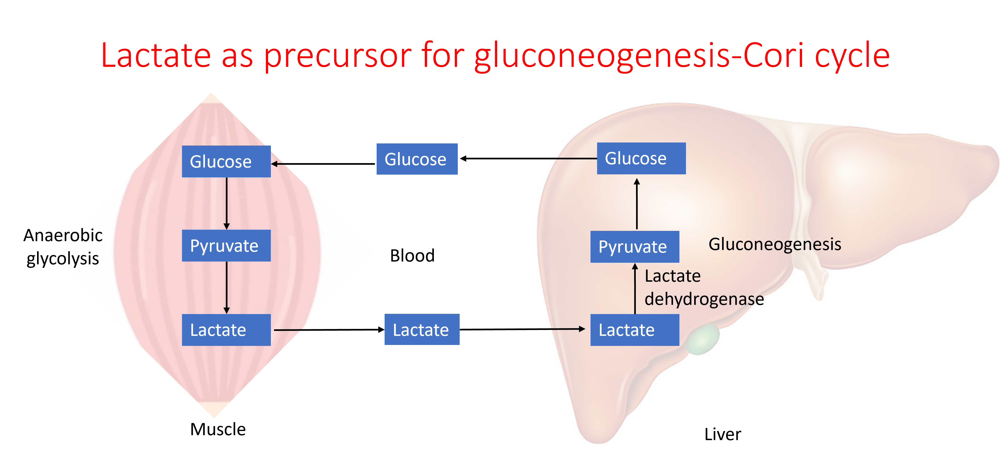
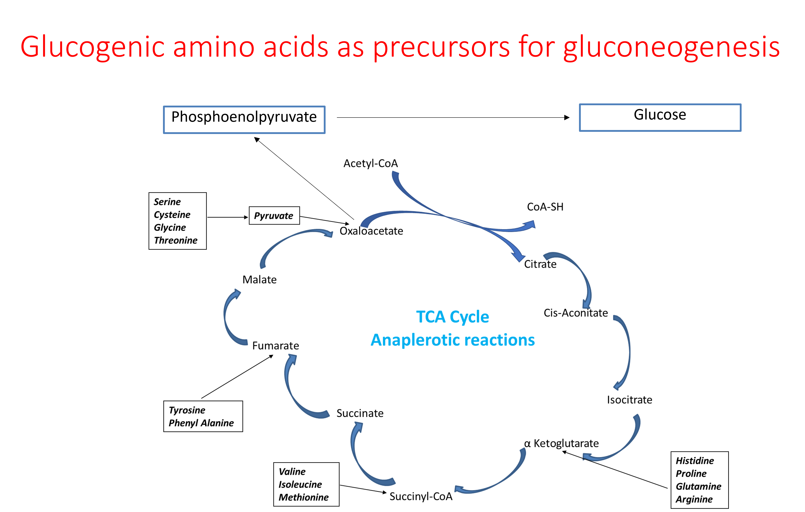
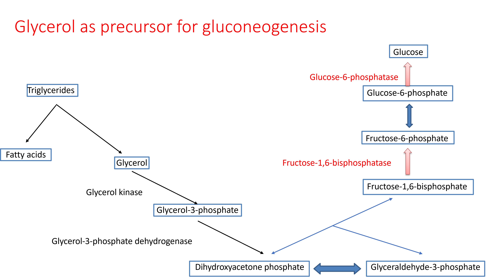
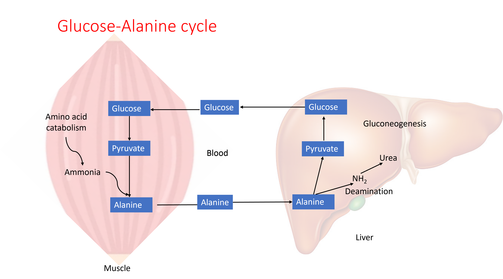
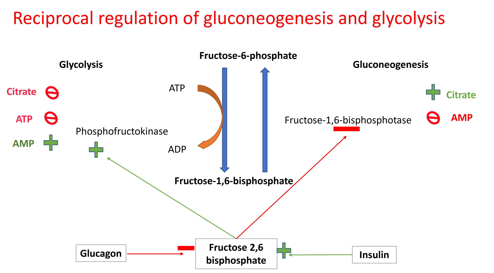

# Gluconeogenesis

Gluconeogenesis is the process of synthesis of glucose from non-carbohydrate sources such as lactate, glucogenic amino acids, glycerol, and propionyl Co-A. Gluconeogenesis occurs mostly in liver and to some extent in kidney. Gluconeogenesis maintains blood glucose levels during fasting and starvation.\

Gluconeogenesis is not a simple reversal of glycolysis. Glycolysis is essentially irreversible (at physiological conditions of the cell) at three steps: phosphoenolpyruvate to pyruvate, fructose-6 phosphate to fructose-1,6 bisphosphate, and glucose to glucose-6 phosphate catalyzed by the enzymes hexokinase, phosphofructokinase, and Pyruvate kinase. In gluconeogenesis, these steps are by passed by 4 reactions catalyzed by different enzymes.\

Pyruvate is converted to phosphoenolpyruvate by two reactions. First pyruvate is carboxylated to oxaloacetate in the mitochondria. Oxaloacetate cannot be transported out of mitochondria. It is reduced to malate and malate is transported from mitochondria to cytoplasm. This reaction oxidizes a NADH molecule to NAD^+^. Malate is oxidized back to oxaloacetate in the cytoplasm which reduces NAD^+^ to NADH. Oxaloacetate is then converted to phosphoenol pyruvate by decarboxylation. In these reactions, reducing equivalents are effectively transported from mitochondria to cytoplasm which is crucial for gluconeogenesis. These reactions also consume two ATP equivalents per pyruvate to phosphoenolpyruvate generation while the opposite reaction generates only one ATP.\

{width=70%, height=300}

Frucose-1,6 bisphosphate is converted to fructose-6 phosphate by the enzyme fructose-1,6 bisphophatase with the release of inorganic phosphate, and glucose-6 phosphate is converted to glucose by the enzyme glucose-6 phosphatase. 

{width=50%, height=300}

## Precursors for gluconeogenesis

Lactate, glucogenic amino acids, glycerol, and propionyl Co-A are the precursors forgluconeogenesis. Lactate is the end product of anaerobic glycolysis in muscle and RBCs. Amino acids are derived from proteins of tissues such as from liver, blood, and muscle. Glycerol is a released from fat during lipolysis. Propionyl Co-A is produced during oxidation of fatty acids with odd number of carbons.

{width=70%, height=300}

{width=70%, height=400}

{width=70%, height=300}

Gluconeogenesis in liver plays a role in clearing ammmonia produced in the muscle from amino acid catabolism

{width=70%, height=300}

## Regulation of glycolysis and gluconeogenesis

Glycolysis and gluconeogenesis are reciprocally regulated. This is achieved by allosteric modification of the enzymes;phosphofructokinase and fructose-1,6-bisphoshatase  by Fructose-2,6-bisphosphate. The levels of Fructose-2,6-bisphosphate is regulated by the hormones; insulin and glucagon.

{width=50%, height=300}
## Practice exercises

1. Which of the following is NOT a substrate for gluconeogenesis?

<label><input type="radio" autocomplete="off" name="radio_AASABCQVEH" value="answer"></input> Acetyl-CoA</label><label><input type="radio" autocomplete="off" name="radio_AASABCQVEH" value=""></input> Lactate</label><label><input type="radio" autocomplete="off" name="radio_AASABCQVEH" value=""></input> Glycerol</label><label><input type="radio" autocomplete="off" name="radio_AASABCQVEH" value=""></input> Alanine</label>

2. Match the pathway with its regulated enzyme

- "Glycogenesis: <select class='webex-select'><option value='blank'></option><option value='answer'>Glycogen synthase</option><option value=''>Glycogen phosphorylase</option><option value=''>Fructose 1,6-Bisphosphatase</option><option value=''>Phosphofructokinase-1</option></select>"

- "Glycogenolysis: <select class='webex-select'><option value='blank'></option><option value=''>Glycogen synthase</option><option value='answer'>Glycogen phosphorylase</option><option value=''>Fructose 1,6-Bisphosphatase</option><option value=''>Phosphofructokinase-1</option></select>"

- "Gluconeogenesis: <select class='webex-select'><option value='blank'></option><option value=''>Glycogen synthase</option><option value=''>Glycogen phosphorylase</option><option value='answer'>Fructose 1,6-Bisphosphatase</option><option value=''>Phosphofructokinase-1</option></select>"

