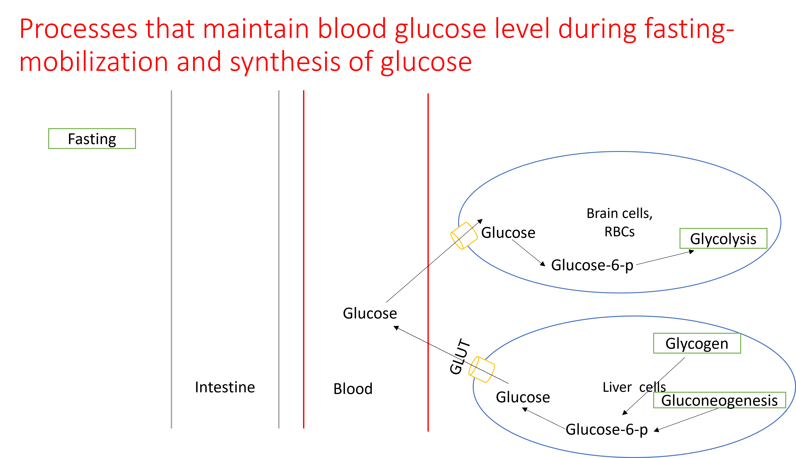

# Regulation of blood glucose

Glucose is a major source of fuel for all cells. Brain and RBCs are completely dependent on glucose for producing energy. Decrease in blood glucose level, called hypoglycemia can lead to impaired function of the brain since glucose is the only source of energy for the brain. If severe, hypoglycemia can cause coma and death. On the other hand, chronic increase in blood glucose level can damage multiple tissues. This is seen in diabetes mellitus.Thus blood glucose level has to be maintained within a narrow range of 70 to 99 mg/dL./

Blood glucose level is maintained within this narrow range by processes that utilize glucose during feeding and processes that mobilize and synthesize glucose fasting./

{width=70%, height=400}

{width=70%, height=400}

These processes are regulated by the peptide hormones insulin and glucagon./

## Insulin

Insulin is a peptide hormone secreted by the beta-cells of the pancreatic islets in response to increase in blood glucose level during feeding. 

### Mechanism of glucose stimulated insulin secretion

<video width="580" height="400" controls>
  <source src="Images/Inssec.mp4" type="video/mp4">
</video>

### Actions of insulin

Insulin stimulates glucose utilization and inhibits glucose production resulting in decrease in blood glucose level. Insulin increases uptake of glucose into adipose tissue and muscle through activation of [GLUT4 transporters](#glucose-transporters).Insulin [stimulates glycolysis and inhibits gluconeogenesis](#regulation-of-glycolysis-and-gluconeogenesis) in liver by increasing the levels of Fructose-2,6 bisphosphate. [Insulin inactivates glycogen phosphorylase and activates glycogen sythase through covalent modifications resulting in activation of glyocgenesis and inhibition of glycogenolysis in liver and muscle](#hormonal-regulation-of-glycogen-metabolism). Insulin also promotes the conversion of glucose to fat in adipose tissue.

## Glucagon

Glucagon is a peptide hormone secreted from the alpha-cells of the pancreatic islets in response to decrease in blood glucose level during fasting. Glucagon stimulates glucose mobilization and promotes glucose production resulting in increase in blood glucose level.

### Actions of glucagon

Glucagon [stimulates gluconeogenesis and inhibits glycolysis](#regulation-of-glycolysis-and-gluconeogenesis) in liver by decreasing the levels of Fructose-2,6 bisphosphate. [Glucagon inactivates glycogen synthase and activates glycogen phosphorylase through covalent modifications resulting in activation of glycogenolysis and inhibition of glyocgenesis in liver and muscle](#hormonal-regulation-of-glycogen-metabolism)./

Epinephrine, cortisol, thyroxine, and growth hormone are other hormones that can blood glucose levels. 

## Practice exercises

1. Which of the following is an effect of insulin?

<label><input type="radio" autocomplete="off" name="radio_CJOHCDXGEB" value=""></input> Increased glycogenolysis in liver</label><label><input type="radio" autocomplete="off" name="radio_CJOHCDXGEB" value=""></input> Increased gluconeogenesis in liver</label><label><input type="radio" autocomplete="off" name="radio_CJOHCDXGEB" value="answer"></input> Increased glucose uptake in adipose tissue and muscle</label><label><input type="radio" autocomplete="off" name="radio_CJOHCDXGEB" value=""></input> Decreased glycolysis in liver</label>

2. Which of the following is an effect of glucagon?

<label><input type="radio" autocomplete="off" name="radio_VNUJHLAFEP" value=""></input> Decreased gluconeogenesis in liver</label><label><input type="radio" autocomplete="off" name="radio_VNUJHLAFEP" value="answer"></input> Increased glycogenolysis in liver</label><label><input type="radio" autocomplete="off" name="radio_VNUJHLAFEP" value=""></input> Increased glucose uptake in adipose tissue and muscle</label><label><input type="radio" autocomplete="off" name="radio_VNUJHLAFEP" value=""></input> Increased glycolysis in liver</label>

3. Which of the following is an effect of epinephrine?

<label><input type="radio" autocomplete="off" name="radio_ITKBZRKCYI" value=""></input> Decreased gluconeogenesis in liver</label><label><input type="radio" autocomplete="off" name="radio_ITKBZRKCYI" value="answer"></input> Increased glycogenolysis in muscle</label><label><input type="radio" autocomplete="off" name="radio_ITKBZRKCYI" value=""></input> Decreased glycogenolysis in liver</label>

