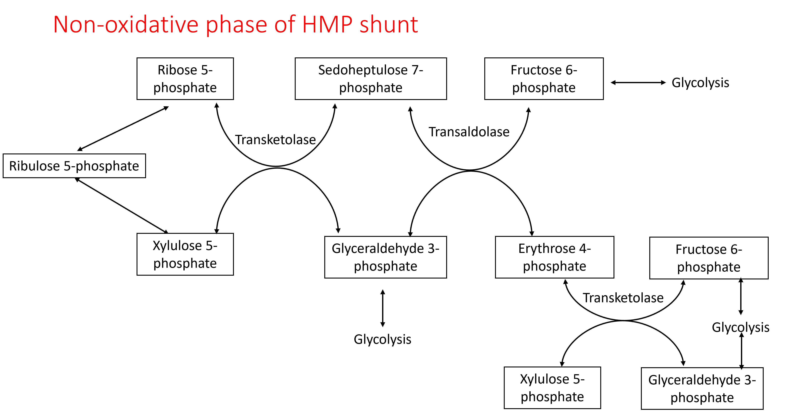
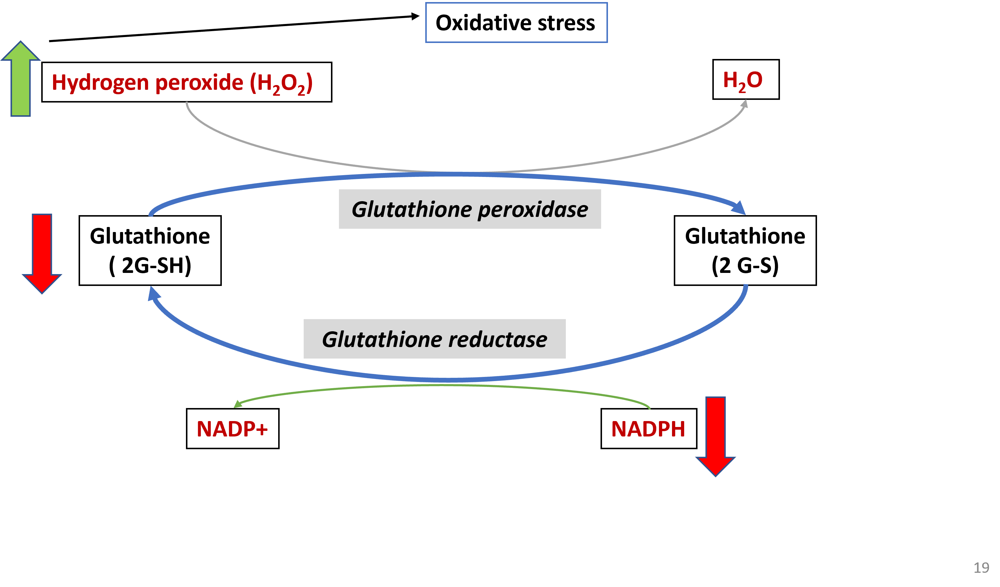

# HMP Pathway

Pentose phosphate pathway otherwise called Hexose monophosphate (HMP) shunt is pathway that occurs in cytoplasm of all cells in which a small fraction of glucose is oxidized. The HMP pathway does not produce ATP. The function of the pathway is to produce NADPH and Ribose.

The HMP pathway has an oxidative and a non-oxidative pahase. In the oxidative phase of the pathway, glucose is oxidized to the five carbon Ribulose-5 phosphate with decarboxylation and reduction of two NADP^+^ to NADPH.

{width=70%, height=300}

{width=70%, height=300}

Ribulose-5 phosphate is converted to ribose-5 phosphate and used by cells if required. If ribose-5 phosphate is not required, the non-oxidative phase of the HMP pathway will convert ribulose-5 phosphate into glycolytic intermediates which could be recycled for either glycolysis or more NADPH production in the oxidative phase.

## Importance of the HMP shunt

### Ribose

Formation of ribose 5-phosphate in all cells for the synthesis of nucleotides

### Functions of NADPH

#### Reductive biosynthesis

Provides electron (reducing agent) during synthesis of: 

 - Fatty acids
 - Cholesterol 
 - Steroid hormones

#### Reducing hydrogen peroxide

Hydrogen peroxide is a highly reactive oxygen containing molecule that can destroy the contents of the cell by oxidation. Hydrogen peroxide is produced during several physiological processes and due to environmental factors, such as ionizing radiation,  pollutants and drugs. Hydrogen peroxide and other such highly reactive oxidants are neutralized by anti-oxidant systems including the Glutathione peroxidase system.

{width=60%, height=400}

Inability to maintain glutathione in reduced state in RBCs leads to accumulation of peroxides causing damage to the cell membrane. The damage to RBC membrane leads to hemolysis. NADPH prevents this./

#### Generation of reactive oxygen species during phagocytosis

Macrophages produce reactive oxygen species to destroy bacteria in a process known as respiratory burst. In respiratory burst, NADPH are used as a source of electrons to reduce oxygen to hydrogen peroxide.

## G6PD deficiency

A common genetic disoder in India and other tropical regions of the world, characterised by defect in the enzyme glucose-6-phosphate dehydrogenase which leads to decreased production of NADPH and increased oxidative stress. In particular, RBCs are more susceptible to oxidative stress and hemolysis. 

{width=60%, height=400}

### Clinical manifestations of G6PD deficiency

 - Increased oxidative stress in RBCs destroys the RBC membrane leading to intravascular hemolysis

 - Increased oxidative stress can be caused by certain drugs (e.g., primaquine), food items (e.g., fava beans), infections

 - Hemolysis leads to anemia

 - The end product of heme catabolism is bilirubin and so hemolysis leads to jaundice

## Practice exercises

1. One of the function of the pentose phosphate pathway is to produce

<label><input type="radio" autocomplete="off" name="radio_GDGTOINEHH" value=""></input> NADH</label><label><input type="radio" autocomplete="off" name="radio_GDGTOINEHH" value="answer"></input> NADPH</label><label><input type="radio" autocomplete="off" name="radio_GDGTOINEHH" value=""></input> ATP</label><label><input type="radio" autocomplete="off" name="radio_GDGTOINEHH" value=""></input> FADH2</label>

1. Which of the following is **NOT** a function of NADPH?

<label><input type="radio" autocomplete="off" name="radio_WPZLHSUURN" value="answer"></input> Providing reducing equivalents for gluconeogenesis</label><label><input type="radio" autocomplete="off" name="radio_WPZLHSUURN" value=""></input> Reductive biosynthesis of steroids</label><label><input type="radio" autocomplete="off" name="radio_WPZLHSUURN" value=""></input> Reduction of glutathione</label><label><input type="radio" autocomplete="off" name="radio_WPZLHSUURN" value=""></input> Synthesis of Nitric oxide</label>

