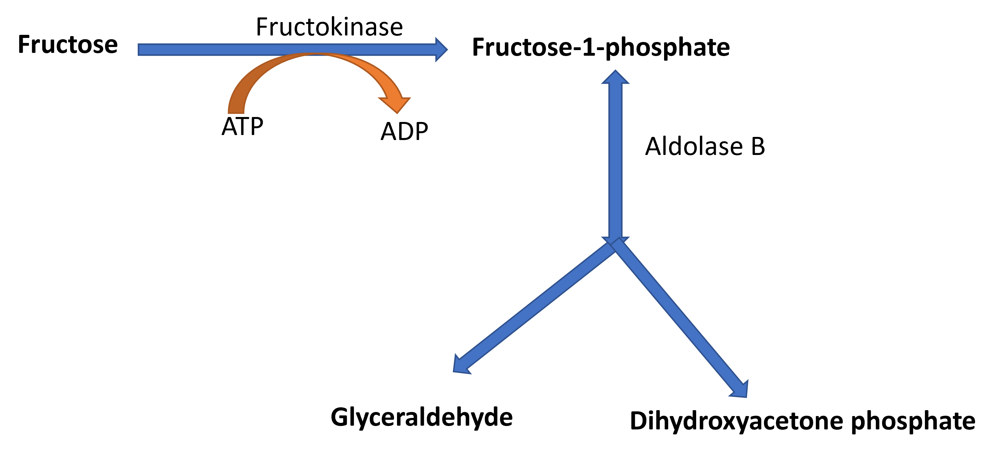

# Fructose metabolism

Fructose is present in fruit juices, honey, cane sugar etc. Cells can use fructose as a fuel directly or after converting it into glucose.

Fructose can enter glycolysis and produce ATP either through hexokinase or through fructokinase and aldolase B.

## Fructose metabolism through hexokinase

{width=60%, height=400}

## Fructose metabolism through fructokinase and Aldolase B

{width=60%, height=400}

## Disorders of fructose metabolism

### Essential fructosuria

Occurs due to genetic defect in the enzyme fructokinase. It is characterized by increased excretion of fructose in urine but it is a benign condition.

### Hereditary fructose intolerance

Occurs due to genetic defect in the enzyme aldolase B. It is characterized by hypoglycemia, hepatomegaly, jaundice and kidney disease. Symptoms occur due to consumption of inorganic phosphate during the conversion of fructose to fructose-1-phosphate. 

## Sorbitol pathway

Glucose can be converted to fructose in liver, testis and seminal vesicles. Fructose produced by the seminal vesicles act as a source of energy for sperm cells. Glucose is first reduced to sorbitol by aldose reductase with the help of NADPH and sorbitol is oxidized to fructose by sorbitol dehydrogenase using NAD^+^.

Tissues such as lens, and capillarie of retina, kidney and nerves convert glucose to sorbitol when glucose is present at high concentration, but they lack sorbitol dehydrogenase resulting in accumulation of sorbitol. In Diabetes Mellitus, accumulation of sorbitol causes osmotic damage to these tissues leading to cataract, retinopathy, nephropathy and neuropathy.

