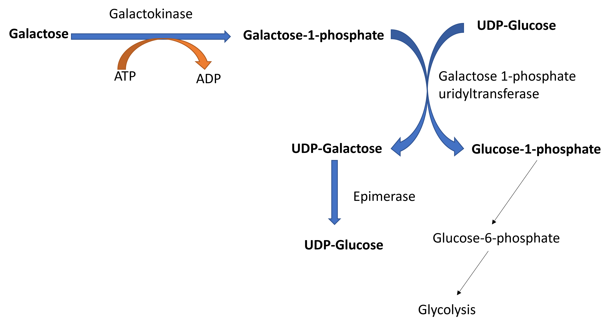

# Galactose metabolism

Galactose is utilized as fuel in cells after being converted into glucose. Galactose is synthesized in mammary glands for production of lactose in milk. 

## Metabolism of galactose

{width=40%, height=300}

## Disorders of galactose metabolism

### Galactokinase deficiency

Leads to increased levels of galactose in blood (galactosemia) and urine (galactosuria).Increased levels of galactose leads to formation of galactitol in lens which causes cataract. 

### Classical galactosemia

Occurs due to genetic defect in the enzyme Galactose 1-phosphate uridyltransferase. It leads to galactosemia and galactosuria. Increased levels of galactose causes cataract, and accumulation of galactose-1-phosphate damages brain, liver and kidney. 

- How do you load the tidyverse package? <input class='webex-solveme nospaces' size='20' data-answer='["library( tidyverse )","library( \"tidyverse\" )","library( &apos;tidyverse&apos; )"]'/>
## Multiple Choice (`mcq()`)
- "Never gonna give you up, never gonna: <select class='webex-select'><option value='blank'></option><option value=''>let you go</option><option value=''>turn you down</option><option value=''>run away</option><option value='answer'>let you down</option></select>"
- "I <select class='webex-select'><option value='blank'></option><option value='answer'>bless the rains</option><option value=''>guess it rains</option><option value=''>sense the rain</option></select> down in Africa" -Toto
## True or False (`torf()`)
- True or False? You can permute values in a vector using `sample()`. <select class='webex-select'><option value='blank'></option><option value='answer'>TRUE</option><option value=''>FALSE</option></select>
## Longer MCQs (`longmcq()`)
When your answers are very long, sometimes a drop-down select box gets formatted oddly. You can use `longmcq()` to deal with this. Since the answers are long, It's probably best to set up the options inside an R chunk with `echo=FALSE`. 
**What is a p-value?**

<label><input type="radio" autocomplete="off" name="radio_HOUICZMVYQ" value=""></input> the probability that the null hypothesis is true</label><label><input type="radio" autocomplete="off" name="radio_HOUICZMVYQ" value="answer"></input> the probability of the observed, or more extreme, data, under the assumption that the null-hypothesis is true</label><label><input type="radio" autocomplete="off" name="radio_HOUICZMVYQ" value=""></input> the probability of making an error in your conclusion</label>

